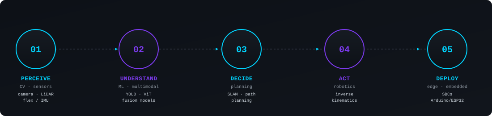

<!--
  =========================================================================
  README.md — GitHub profile for Yasmin Walid Abou Elsaad
  =========================================================================
-->

  

<i>Building intelligent systems that perceive, decide, and act.</i>

Computer Vision · Autonomous Robotics · Edge AI

  

  
  
  

I'm an AI & Robotics Engineer focused on building intelligent systems that bridge the gap between algorithms and the physical world. My work spans computer vision, autonomous robotics, multimodal AI, and edge deployment — combining perception, decision-making, and control to turn real-world data into systems that can understand, act, and adapt. From autonomous robots competing in real-world environments to research on efficient AI for resource-constrained hardware, I'm interested in making intelligent systems not only accurate, but practical, responsive, and deployable.

  

Perceive the world, understand what matters, decide, act, and deploy the intelligence where it needs to run.

## Selected Work

<table>
<tr>
<td width="50%" valign="top">

### 🤖 Autonomous Home Robot
Full navigation stack for a home service robot — SLAM, ML-based path planning, and inverse kinematics driven by a real-time detection pipeline.

`ROS` `SLAM` `Path Planning` `Inverse Kinematics`

**🥇 1st Place — RoboCup@Home Egypt National Championship 2025**

</td>
<td width="50%" valign="top">

### 🧤 IntelliGlove
Wearable glove fusing flex-sensor and IMU data through an ML classifier to translate Arabic Sign Language into text and speech in real time.

`Flex Sensors` `IMU` `Sensor Fusion` `Embedded ML`

[Repository →](https://github.com/Ysm-wld/IntelliGlove.git)

</td>
</tr>
<tr>
<td width="50%" valign="top">

### 🎧 Multimodal AI
Fuses a Vision Transformer, audio, and language models across concatenation, cross-attention, and late-fusion strategies — testing whether SimCLR pretraining improves downstream results.

`Vision Transformer` `Whisper/Wav2Vec` `BERT/T5` `SimCLR`

*Research / exploratory*

</td>
<td width="50%" valign="top">

### 📱 Eduro
Full-stack Flutter app pairing study automation with personalized AI guidance.

`Flutter` `Dart`

</td>
</tr>
</table>

 

## Research

<table>
<tr>
<td width="14" style="background-color:#14B8A6;"></td>
<td>

<b>PUBLISHED · PEER-REVIEWED</b>

### Benchmarking YOLOv8–YOLOv12 for Real-Time Object Detection on Single-Board Computers

*Machine Learning and Knowledge Extraction · 2026*

Benchmarks YOLOv8 through YOLOv12 across Raspberry Pi, NVIDIA Jetson, and LattePanda, evaluating FPS, mAP, RAM, and FLOPs for real-time edge deployment.

**Contribution:** benchmark execution · data interpretation · results visualization · literature review

</td>
</tr>
</table>

 

**Multimodal Wearable Dataset for Arabic Sign Language Recognition** — *in progress, extending IntelliGlove*

 

## Engineering Stack

**Perception** — `Python` `OpenCV` `YOLO` `PyTorch` `Transformers` 
**Robotics** — `ROS` `SLAM` `Path Planning` `Inverse Kinematics` 
**Edge & Embedded** — `C/C++` `Arduino` `ESP32` `Jetson` `Raspberry Pi` 
**Systems** — `Linux` `Docker` `Git` `SQL`

 

## Currently Exploring

- Uncertainty-aware perception, beyond raw confidence scores
- On-device inference for multimodal / self-supervised models

 

<b>Other technical experience</b> — security engineering

 

Architected and deployed a full SIEM/SOC pipeline (Sep 2025 – Jan 2026): Wazuh, OpenSearch, Suricata, and OpenEDR for detection, MISP for threat intelligence, and Shuffle for automated incident-response playbooks.

`Wazuh` `OpenSearch` `Suricata` `OpenEDR` `MISP` `Shuffle`

 

GitHub stats

 

  

 

  Alexandria, Egypt

